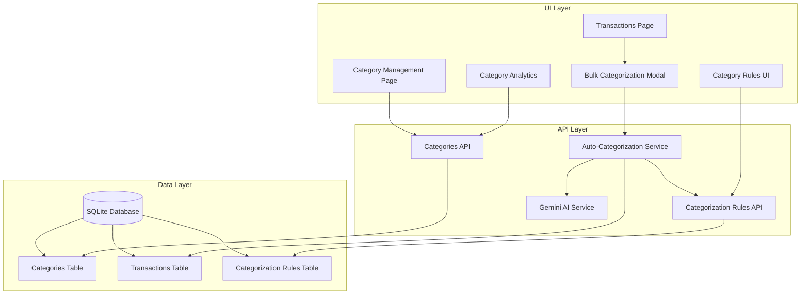

# Transaction Categorization Feature Plan

## Overview

This plan outlines a comprehensive categorization system for the spending tracking application. The goal is to provide users with powerful tools to organize, analyze, and understand their spending patterns through intelligent categorization.

## Current State Analysis

### What Already Exists

1. **Database Schema**
 - [`Category`](prisma/schema.prisma:54) model with hierarchical support (parent/child)
 - [`Transaction`](prisma/schema.prisma:67) linked to Category via `categoryId`
 - Categories have: id, name, color, icon, parentId

2. **API Endpoints**
 - `GET /api/categories` - List all categories
 - `POST /api/categories` - Create category
 - `PUT /api/transactions` - Update transaction category

3. **UI Components**
 - [`TransactionList`](src/components/transactions/TransactionList.tsx:1) with manual categorization modal
 - Dashboard shows basic category breakdown

### What's Missing

1. **AI-powered automatic categorization** during PDF parsing
2. **Category management page** (CRUD operations)
3. **Categorization rules engine** (user-defined keyword rules)
4. **Bulk categorization** capabilities
5. **Smart suggestions** based on history
6. **Enhanced category analytics** and reports

---

## Feature Architecture



---

## Implementation Plan

### Phase 1: Database Schema Updates

#### 1.1 Add Categorization Rules Model

Create a new model to store user-defined categorization rules:

```prisma
model CategorizationRule {
 id          String   @id @default(cuid())
 categoryId  String
 category    Category @relation(fields: [categoryId], references: [id], onDelete: Cascade)
 keywords    String   // Comma-separated keywords
 matchType   String   @default("contains") // contains, exact, regex
 priority    Int      @default(0) // Higher = more important
 isActive    Boolean  @default(true)
 createdAt   DateTime @default(now())
 updatedAt   DateTime @updatedAt
 
 @@index([categoryId])
}
```

#### 1.2 Update Category Model

Add fields for better category management:

```prisma
model Category {
 id           String   @id @default(cuid())
 name         String
 color        String   @default("#6B7280")
 icon         String?
 parentId     String?
 parent       Category?  @relation("CategoryHierarchy", fields: [parentId], references: [id])
 children     Category[] @relation("CategoryHierarchy")
 transactions Transaction[]
 rules        CategorizationRule[]
 isSystem     Boolean  @default(false) // System default categories
 budget       Float?   // Optional monthly budget
 
 @@unique([name])
}
```

---

### Phase 2: Default Categories Seed

Create a comprehensive set of default categories with icons and colors:

| Category | Icon | Color | Subcategories |
|----------|------|-------|---------------|
| Food & Dining | Utensils | #EF4444 | Restaurants, Groceries, Coffee, Fast Food |
| Transportation | Car | #3B82F6 | Gas, Public Transit, Uber/Lyft, Parking |
| Shopping | ShoppingBag | #8B5CF6 | Clothing, Electronics, Home Goods |
| Entertainment | Film | #F59E0B | Movies, Games, Streaming, Events |
| Bills & Utilities | Receipt | #10B981 | Electricity, Water, Internet, Phone |
| Health | Heart | #EC4899 | Pharmacy, Doctor, Insurance |
| Income | TrendingUp | #22C55E | Salary, Freelance, Investments |
| Transfer | ArrowRightLeft | #6366F1 | Internal Transfer |
| Other | MoreHorizontal | #6B7280 | Uncategorized |

---

### Phase 3: API Development

#### 3.1 Enhanced Categories API

**File:** `src/app/api/categories/route.ts`

Enhance with:
- `GET` - Include transaction count, budget status
- `POST` - Create with validation
- Add hierarchical tree structure endpoint

**New File:** `src/app/api/categories/[id]/route.ts`

- `PUT` - Update category
- `DELETE` - Delete with transaction reassignment option

#### 3.2 Categorization Rules API

**New File:** `src/app/api/categorization-rules/route.ts`

- `GET` - List all rules with category info
- `POST` - Create new rule
- `PUT` - Update rule
- `DELETE` - Remove rule

#### 3.3 Auto-Categorization Service

**New File:** `src/lib/autoCategorize.ts`

```typescript
interface CategorizationResult {
 categoryId: string | null;
 confidence: number; // 0-1
 matchedRule?: string;
}

export async function autoCategorize(
 description: string,
 amount: number,
 existingRules: CategorizationRule[]
): Promise<CategorizationResult> {
 // 1. Check user-defined rules first (highest priority)
 // 2. Check AI suggestion if no rule matches
 // 3. Return best match with confidence score
}
```

#### 3.4 Integration with PDF Parser

Update [`src/lib/pdfParser.ts`](src/lib/pdfParser.ts:1) to:
1. Auto-categorize transactions during parsing
2. Store confidence score
3. Flag low-confidence categorizations for review

---

### Phase 4: UI Components

#### 4.1 Category Management Page

**New File:** `src/app/categories/page.tsx`

Features:
- List all categories in hierarchical tree view
- Create/Edit/Delete categories
- Color picker for category colors
- Icon selector
- Set monthly budgets
- View transaction count per category

#### 4.2 Category Form Component

**New File:** `src/components/categories/CategoryForm.tsx`

```typescript
interface CategoryFormProps {
 category?: Category;
 parentId?: string;
 onSave: (data: CategoryFormData) => void;
 onCancel: () => void;
}
```

#### 4.3 Category Rules Component

**New File:** `src/components/categories/CategoryRules.tsx`

Features:
- List existing rules
- Create new keyword-based rules
- Set priority/order
- Test rule against sample text

#### 4.4 Bulk Categorization Modal

**New File:** `src/components/transactions/BulkCategorizeModal.tsx`

Features:
- Select multiple transactions
- Apply category to all selected
- Filter by uncategorized
- Filter by similar descriptions

#### 4.5 Enhanced Transaction List

Update [`TransactionList`](src/components/transactions/TransactionList.tsx:1) to:
- Show categorization confidence indicator
- Quick category assignment dropdown
- Bulk selection checkboxes
- Filter by categorized/uncategorized

---

### Phase 5: Category Analytics

#### 5.1 Enhanced Dashboard Charts

Update [`src/components/dashboard/Charts.tsx`](src/components/dashboard/Charts.tsx:1):

- Donut chart for category breakdown
- Bar chart for category comparison over time
- Budget vs Actual per category

#### 5.2 Category Insights Page

**New File:** `src/app/categories/insights/page.tsx`

Features:
- Spending by category (current month vs average)
- Category trends over time
- Budget tracking with progress bars
- Top merchants per category
- Uncategorized transactions alert

---

## File Structure

```
src/
├── app/
│   ├── api/
│   │   ├── categories/
│   │   │   ├── route.ts (enhanced)
│   │   │   ├── [id]/route.ts (new)
│   │   │   └── seed/route.ts (enhanced)
│   │   ├── categorization-rules/
│   │   │   └── route.ts (new)
│   │   └── transactions/
│   │       └── bulk-categorize/route.ts (new)
│   ├── categories/
│   │   ├── page.tsx (new)
│   │   └── insights/
│   │       └── page.tsx (new)
│   └── transactions/
│       └── page.tsx (enhanced)
├── components/
│   ├── categories/
│   │   ├── CategoryForm.tsx (new)
│   │   ├── CategoryList.tsx (new)
│   │   ├── CategoryRules.tsx (new)
│   │   ├── CategoryTree.tsx (new)
│   │   └── index.ts (update)
│   └── transactions/
│       ├── BulkCategorizeModal.tsx (new)
│       └── TransactionList.tsx (enhanced)
├── lib/
│   ├── autoCategorize.ts (new)
│   └── pdfParser.ts (enhanced)
└── types/
    └── index.ts (update with new types)
```

---

## Implementation Order

### Sprint 1: Foundation
1. [ ] Update Prisma schema with CategorizationRule model and Category enhancements
2. [ ] Run database migration
3. [ ] Create enhanced default categories seed script
4. [ ] Update Categories API with CRUD operations

### Sprint 2: Rules Engine
5. [ ] Create Categorization Rules API
6. [ ] Build auto-categorization service
7. [ ] Integrate with PDF parser for automatic categorization
8. [ ] Add confidence scoring to transactions

### Sprint 3: Management UI
9. [ ] Create Category Management page
10. [ ] Build CategoryForm component with color/icon pickers
11. [ ] Create CategoryRules component
12. [ ] Add to navigation/sidebar

### Sprint 4: Bulk Operations
13. [ ] Add bulk selection to TransactionList
14. [ ] Create BulkCategorizeModal component
15. [ ] Create bulk-categorize API endpoint
16. [ ] Add uncategorized filter

### Sprint 5: Analytics
17. [ ] Enhance dashboard category charts
18. [ ] Create Category Insights page
19. [ ] Add budget tracking per category
20. [ ] Add category comparison views

---

## Technical Considerations

### Performance
- Index `categoryId` and `description` for fast rule matching
- Cache categorization rules in memory
- Use debouncing for bulk operations

### AI Integration
- Use Gemini for smart categorization suggestions
- Store confidence scores for transparency
- Allow user override with rules taking precedence

### User Experience
- Show categorization confidence with visual indicators
- Easy override mechanism for miscategorized items
- Learning from user corrections

---

## Questions for Clarification

1. **Budget Feature**: Should we include monthly budget tracking per category in this implementation?

2. **AI Categorization**: Should AI categorization be automatic during upload, or should users trigger it manually?

3. **Subcategories**: Do you want full hierarchical category support (parent/child), or flat categories only?

4. **Category Colors/Icons**: Should users be able to fully customize colors and icons, or use a preset palette?

5. **Learning System**: Should the system learn from user corrections to improve future categorizations?

---

## Success Metrics

- [ ] 90%+ of transactions auto-categorized during upload
- [ ] Users can manage categories through dedicated UI
- [ ] Bulk categorization reduces manual work by 80%
- [ ] Category analytics provide actionable spending insights
