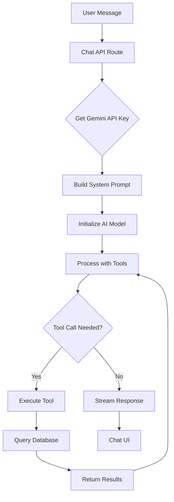

# Chatbot Integration Plan for Xpend

## Overview

Add an AI-powered chatbot to the xpend spending tracker app that allows users to query and modify their financial data using natural language. The chatbot will appear as a **floating widget in the bottom-right corner** on all pages, leverage the existing Gemini API integration, and persist chat history for later reference.

## Architecture Analysis

### Current Xpend Stack
- **Frontend**: Next.js 16, React 19, Tailwind CSS 4
- **Backend**: Next.js API routes under `src/app/api`
- **Database**: Prisma + PostgreSQL
- **AI**: Google Gemini (already used for PDF parsing and categorization)
- **Auth**: Supabase

### Vercel AI Chatbot Reference
The [Vercel AI Chatbot](https://github.com/vercel/chatbot) provides:
- Vercel AI SDK for streaming responses
- Multi-provider support (OpenAI, Anthropic, Google, etc.)
- Chat history persistence
- Modern UI components

## Integration Strategy

Since xpend already uses Gemini AI, we will use the **Vercel AI SDK** with the **Google Generative AI provider** to maintain consistency.

### Key Components to Add

```
src/
├── app/
│   └── api/
│       └── chat/
│           └── route.ts          # Chat API with Vercel AI SDK
├── components/
│   └── chat/
│       ├── ChatWidget.tsx        # Floating widget wrapper
│       ├── ChatInterface.tsx     # Main chat UI panel
│       ├── ChatMessage.tsx       # Message bubble component
│       ├── ChatInput.tsx         # Input area with send button
│       └── index.ts
├── lib/
│   └── chat/
│       ├── tools.ts              # AI tools for querying and modifying data
│       ├── systemPrompt.ts       # System prompt for financial context
│       └── contextBuilder.ts     # Build context from user data
```

## Features

### Phase 1: Core Chat Functionality
1. **Natural Language Queries**
   - "How much did I spend on groceries this month?"
   - "What are my top 5 expense categories?"
   - "Show me transactions above $100"

2. **Spending Insights**
   - Compare spending vs previous periods
   - Identify unusual transactions
   - Budget status updates

3. **Transaction Search**
   - Find transactions by merchant, date, amount
   - Filter by category or account

### Phase 2: Data Modification Actions
1. **Categorize Transactions**
   - "Categorize the Uber transaction as Transportation"
   - "Set all Amazon purchases to Shopping"

2. **Create Categorization Rules**
   - "Always categorize Starbucks as Dining"
   - "Create a rule for Netflix to Entertainment"

3. **Bulk Updates**
   - "Mark all recurring Netflix transactions"
   - "Add notes to transactions from Whole Foods"

### Phase 3: Advanced Features
1. **Proactive Suggestions**
   - Budget alerts
   - Saving tips based on spending patterns
   - Bill payment reminders

2. **Export and Reports**
   - Generate summaries from chat
   - Export filtered data

## Technical Implementation

### Dependencies to Add
```json
{
  "ai": "^4.0.0",
  "@ai-sdk/google": "^1.0.0"
}
```

### API Route Structure

```typescript
// src/app/api/chat/route.ts
import { google } from '@ai-sdk/google';
import { streamText } from 'ai';

export async function POST(req: Request) {
  const { messages } = await req.json();
  
  // Get Gemini API key from Settings
  const apiKey = await getGeminiApiKey();
  
  const result = streamText({
    model: google('gemini-1.5-flash', { apiKey }),
    system: await buildSystemPrompt(),
    messages,
    tools: {
      getTransactions,
      getSpendingByCategory,
      getMonthlySummary,
      searchTransactions,
    },
  });
  
  return result.toDataStreamResponse();
}
```

### AI Tools Definition

```typescript
// src/lib/chat/tools.ts
import { tool } from 'ai';
import { z } from 'zod';

// Query tools
export const getTransactions = tool({
  description: 'Get transactions with optional filters',
  parameters: z.object({
    dateFrom: z.string().optional(),
    dateTo: z.string().optional(),
    categoryId: z.string().optional(),
    minAmount: z.number().optional(),
    maxAmount: z.number().optional(),
    limit: z.number().default(10),
  }),
  execute: async (params) => {
    // Query Prisma for transactions
  },
});

export const getSpendingByCategory = tool({
  description: 'Get spending breakdown by category',
  parameters: z.object({
    dateFrom: z.string().optional(),
    dateTo: z.string().optional(),
  }),
  execute: async (params) => {
    // Aggregate spending by category
  },
});

// Modification tools
export const categorizeTransaction = tool({
  description: 'Categorize a specific transaction',
  parameters: z.object({
    transactionId: z.string(),
    categoryId: z.string(),
  }),
  execute: async (params) => {
    // Update transaction category
  },
});

export const createCategorizationRule = tool({
  description: 'Create a new categorization rule',
  parameters: z.object({
    keywords: z.string(),
    categoryId: z.string(),
    matchType: z.enum(['exact', 'contains', 'regex']),
  }),
  execute: async (params) => {
    // Create new rule in database
  },
});

export const updateTransactionNotes = tool({
  description: 'Add or update notes on a transaction',
  parameters: z.object({
    transactionId: z.string(),
    notes: z.string(),
  }),
  execute: async (params) => {
    // Update transaction notes
  },
});
```

### System Prompt

```typescript
// src/lib/chat/systemPrompt.ts
export async function buildSystemPrompt(): Promise<string> {
  const categories = await prisma.category.findMany();
  const accounts = await prisma.account.findMany();
  
  return `You are a helpful financial assistant for the xpend spending tracker app.

Available categories: ${categories.map(c => c.name).join(', ')}
User accounts: ${accounts.map(a => a.name).join(', ')}

You can help users:
- Query their transactions and spending
- Understand their financial patterns
- Get insights about their expenses
- Find specific transactions

Always be concise and helpful. Format numbers as currency when appropriate.`;
}
```

## UI Design

### Floating Widget Layout (Bottom-Right Corner)
```
Main Application Window
┌─────────────────────────────────────────────────────────────────┐
│  Dashboard / Accounts / Transactions / etc.                     │
│                                                                 │
│                                                                 │
│                                                                 │
│                                                                 │
│                                                                 │
│                                                                 │
│                                                                 │
│                                            ┌──────────────────┐ │
│                                            │ 💬 Chat       ✕ │ │
│                                            ├──────────────────┤ │
│                                            │                  │ │
│                                            │ 🤖 Hi! How can   │ │
│                                            │    I help you?   │ │
│                                            │                  │ │
│                                            │ 👤 What did I    │ │
│                                            │    spend on      │ │
│                                            │    groceries?    │ │
│                                            │                  │ │
│                                            │ 🤖 You spent     │ │
│                                            │    $342.50...    │ │
│                                            │                  │ │
│                                            ├──────────────────┤ │
│                                            │ [Type...    ] ➤ │ │
│                                            └──────────────────┘ │
└─────────────────────────────────────────────────────────────────┘
```

### Widget States
1. **Collapsed**: Small circular button with chat icon in bottom-right
2. **Expanded**: Full chat panel (380px wide, 500px tall)
3. **Full Height**: Expandable to full screen height option

## Implementation Steps

### Step 1: Install Dependencies
```bash
npm install ai @ai-sdk/google zod
```

### Step 2: Update Prisma Schema for Chat History
- Add `ChatSession` and `ChatMessage` models to schema
- Run migration to create tables

### Step 3: Create Chat API Route
- Create `src/app/api/chat/route.ts`
- Implement streaming response with Vercel AI SDK
- Connect to existing Gemini API key from Settings
- Save messages to database

### Step 4: Create AI Tools
- Create `src/lib/chat/tools.ts`
- Implement query tools (getTransactions, getSpendingByCategory)
- Implement modification tools (categorizeTransaction, createCategorizationRule)
- Add category and account context

### Step 5: Build Chat UI Components
- Create `src/components/chat/` directory
- Build ChatWidget (floating button + panel container)
- Build ChatInterface, ChatMessage, ChatInput components
- Add loading states and error handling
- Style with existing Tailwind configuration

### Step 6: Integrate Widget into Layout
- Add ChatWidget to `src/app/layout.tsx`
- Ensure it appears on all pages
- Position fixed bottom-right

### Step 7: Implement Chat History
- Load previous conversations on widget open
- Display conversation list
- Allow starting new conversations

## Database Schema for Chat History

```prisma
model ChatSession {
  id        String   @id @default(cuid())
  title     String?  // Auto-generated or user-defined
  createdAt DateTime @default(now())
  updatedAt DateTime @updatedAt
  messages  ChatMessage[]
  
  @@index([createdAt])
}

model ChatMessage {
  id        String   @id @default(cuid())
  sessionId String
  session   ChatSession @relation(fields: [sessionId], references: [id], onDelete: Cascade)
  role      String   // "user" or "assistant"
  content   String
  createdAt DateTime @default(now())
  
  @@index([sessionId])
  @@index([createdAt])
}
```

## Security Considerations

1. **Authentication**: Ensure chat API requires auth via Supabase
2. **Data Access**: Only query transactions for authenticated user
3. **Rate Limiting**: Implement rate limits to prevent abuse
4. **API Key Security**: Continue storing Gemini key in Settings table

## Mermaid Diagram



## Confirmed Requirements

Based on user feedback:
1. **Placement**: ✅ Floating widget in bottom-right corner on all pages
2. **Chat History**: ✅ Persist conversations for later reference
3. **Scope**: ✅ Both query AND modify capabilities (categorize, create rules)
4. **Authentication**: Inherit from existing Supabase auth

## Next Steps

Ready to implement! Switch to Code mode to begin:
1. Install Vercel AI SDK dependencies
2. Update Prisma schema with ChatSession and ChatMessage models
3. Create chat API route with tools
4. Build floating chat widget components
5. Integrate into layout
